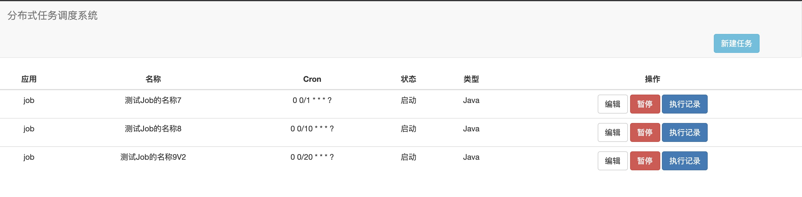
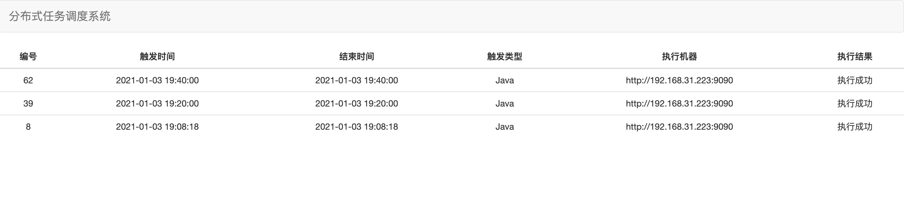

# job - 分布式任务调度系统

* Java8
* SpringBoot
* Zookeeper
* Quartz
* Jetty
* Feign
* Jackson
* ThreadPoolExecutor


### 关于Quartz


Quartz底层基于QuartzSchedulerThread作为调度线程，从线程池(SimpleThreadPool)中获取可用的线程，然后从JobStore(ARM/DB)中的获取
30S(默认30S，为避免频繁扫表，可适当增加该时间)内即将执行的触发器(即将执行的触发器是由另一线程进行插入)，然后通过线程池的线程进行调度执行
JobRunShell。


基于Quartz实现HA，也会出现一些问题，如ABA问题，资源闲置

#### ABA问题
乐观锁ABA问题：
Quartz默认使用乐观锁形式进行获取Trigger，乐观锁就会存在ABA的问题，在JobStoreSupport中：

```java
this.getDelegate().updateTriggerStateFromOtherState(conn, triggerKey, "ACQUIRED", "WAITING");
```

将 triggerKey 对应的数据(QRTZ_TRIGGERS表)TRIGGER_STATE由WAITINGA变更为ACQUIRED，低概率下会出现如下问题：
由于波动，或CPU资源被抢占，那么可能会进入停顿，此时另一机器完成另整个过程WAITING->ACQUIRED->EXECUTING->WAITING，
那么该Job就会出现多次触发。

#### 资源闲置

HA利用Quartz支持集群方式，但是任务调度采用抢占式，集群机器数量越多，就会越多机器参与资源竞争，必然造成资源浪费。

本次调度系统对Spring的SchedulerFactoryBean配置类进行改造，使用自定义的org.quartz.jobStore.class，重写
acquireNextTrigger方法，根据当前机器编号和总的机器数量，利用Trigger的hashCode%机器数量，等于当前机器编号
的Trigger则由当前机器执行，当前机器编号和总的机器数量实时从ZK上获取(该方案未经生产环境验证)。

### 上手

* 安装JDK、Zookeeper、MySQL环境
* 启动Zookeeper、MySQL
* 初始化SQL，执行server模块resource目录下init.sql
* 修改demo模块、server模块application.properties文件
```properties
#当前应用名称
app.name = job
#zk地址
job.zkAddress=127.0.0.1
```
* demo模块编写自定义JobHandler
```java
@JobHandler("demoTask")
public class Task extends AbstractJobHandler {
        
    /**
    * JobParam中包含Job实例ID，分片索引，分片数量
    */
    @Override
    public <T> Result<T> execute(JobParam jobParam) throws Exception {
           
     }
}
```
* 启动demo模块
* 启动server模块
* 访问server后台页面，配置Job任务。默认端口8089，http://127.0.0.1:8089/manager/jobList.html

* Job列表


* Job实例列表



### 分布式任务调度

Client模块定义JobHandler注解和抽象类AbstractJobHandler，IOC容器启动后会初始化 JobManager，
JobManager负责：注册应用信息、获取JobHandler、启动Jetty。

Starter模块负责定义配置信息(spring-configuration-metadata.json)以及import类(JobConfiguration)的实现

Server模块监听注册中心的应用信息，提供Job定义(JobDefinition)的可视化界面，Job定义后会写入调度中心(Scheduler)，
调度中心负责每次Job的执行(JobInstance)

Common模块保存Client和Server通用信息

#### Client


### Server


### 线程池管理工具

在分布式任务调度系统中，客户端任务在特定场景下使用多线程进行任务处理，如数据同步。

问题一：多线程如果同步时间过久(死循环或无超时的Http请求)，造成后续任务无法正常执行。

问题二：任务调度系统成功执行，但是线程内部执行异常，无法监控。

基于上面问题，对于JDK原生ThreadPoolExecutor进行改造，改造类为ThreadPoolExecutorManager，
该类的核心目标为：任务堆积时告警、拒绝任务时告警、核心参数修改、线程执行情况监听、线程中断(对于IO阻塞，无法中断)。


