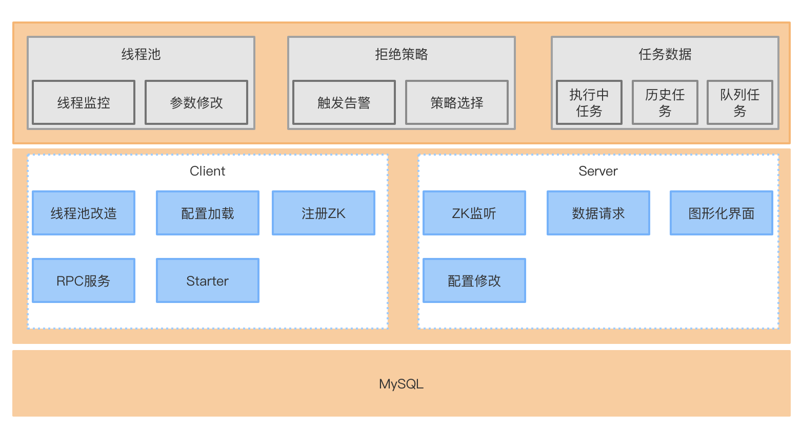

# job - 分布式任务调度系统

* Java8
* SpringBoot
* Zookeeper
* Quartz
* Jetty
* Feign
* Jackson
* ThreadPoolExecutor

### 线程池管理工具

在分布式任务调度系统中，客户端任务在特定场景下使用多线程进行任务处理，如数据同步。

问题一：多线程如果同步时间过久(死循环或无超时的Http请求)，造成后续任务无法正常执行。

问题二：任务调度系统成功执行，但是线程内部执行异常，无法监控。

基于上面问题，对于JDK原生ThreadPoolExecutor进行改造，改造类为ThreadPoolExecutorManager，
该类的核心目标为：任务堆积时告警、拒绝任务时告警、核心参数修改、线程执行情况监听、线程中断。

### 分布式任务调度

待更新......