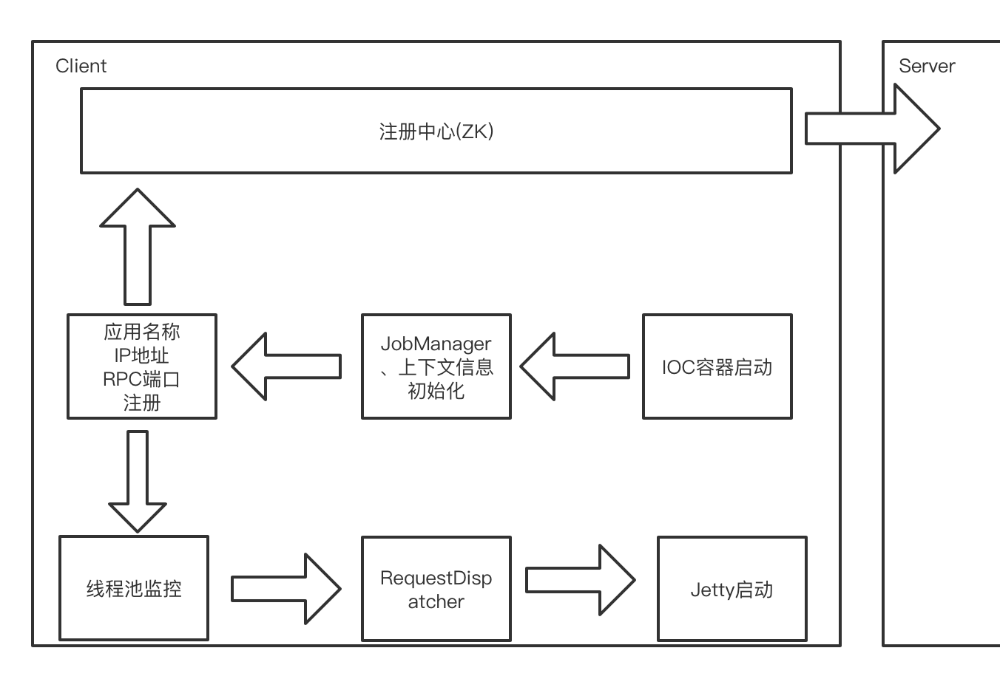
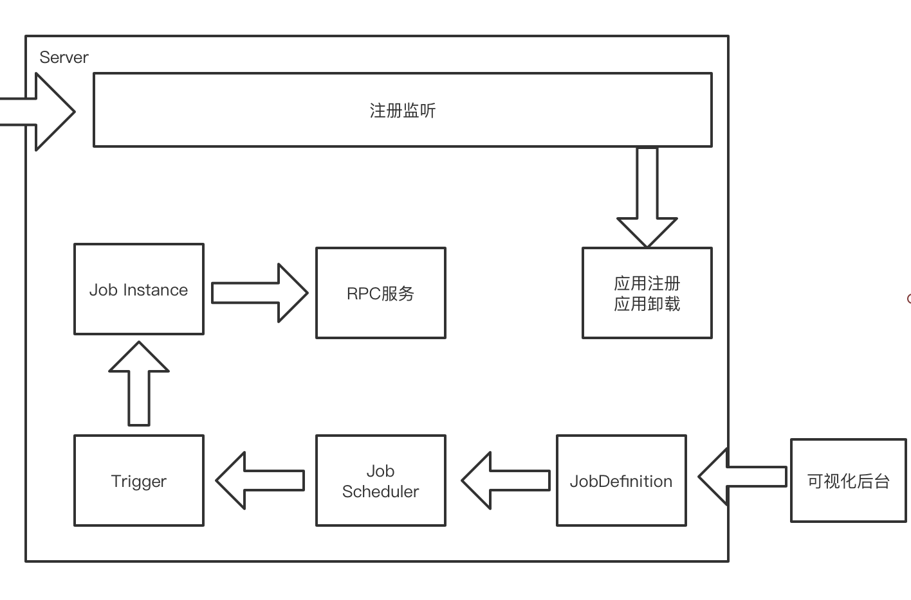

# job - 分布式任务调度系统

* Java8
* SpringBoot
* Zookeeper
* Quartz
* Jetty
* Feign
* Jackson
* ThreadPoolExecutor

### 关于Quartz

分布式任务调度系统基于Quartz实现，关于Quartz工作原理：
Quartz的调度：基于QuartzSchedulerThread作为调度线程，从线程池(SimpleThreadPool)中获取可用的线程，然后从JobStore(ARM/DB)中的获取
30S(默认30S，为避免频繁锁表，可适当增加该时间)内即将执行的触发器(即将执行的触发器是由另一线程进行插入)，然后通过线程池的线程进行调度执行。

基于Quartz实现HA，也会出现一些问题：ABA问题，资源闲置

#### ABA问题
乐观锁ABA问题：
Quartz默认使用乐观锁形式进行获取Trigger，乐观锁就会存在ABA的问题，在JobStoreSupport中：

```java
this.getDelegate().updateTriggerStateFromOtherState(conn, triggerKey, "ACQUIRED", "WAITING");
```

将 triggerKey 对应的数据(QRTZ_TRIGGERS表)TRIGGER_STATE由ACQUIRED变更为WAITING，低概率下会出现如下问题：
由于波动，或CPU资源被抢占，那么可能会进入停顿，此时另一机器完成另整个过程ACQUIRED->WAITING->EXECUTING->ACQUIRED，
那么该Job就会出现多次触发。

#### 资源闲置

调度中心HA采用集群方式，但是任务调度采用抢占式，集群机器数量越多，就会越多机器参与资源竞争，必然造成资源浪费。

预备解决方案：开启被关锁后，每一台机器都会进行抢占，存在机器闲置，采用一致性hash使每台机器都拉取一部分执行器(待实现)。

### Demo

等待更新......

### 线程池管理工具

在分布式任务调度系统中，客户端任务在特定场景下使用多线程进行任务处理，如数据同步。

问题一：多线程如果同步时间过久(死循环或无超时的Http请求)，造成后续任务无法正常执行。

问题二：任务调度系统成功执行，但是线程内部执行异常，无法监控。

基于上面问题，对于JDK原生ThreadPoolExecutor进行改造，改造类为ThreadPoolExecutorManager，
该类的核心目标为：任务堆积时告警、拒绝任务时告警、核心参数修改、线程执行情况监听、线程中断(对于IO阻塞，无法中断)。


### 分布式任务调度

Client模块定义JobHandler注解和抽象类AbstractJobHandler，IOC容器启动后会初始化 JobManager，
JobManager负责：注册应用信息、获取JobHandler、启动Jetty。

Starter模块负责定义配置信息(spring-configuration-metadata.json)以及import类(JobConfiguration)的实现

Server模块监听注册中心的应用信息，提供Job定义(JobDefinition)的可视化界面，Job定义后会写入调度中心(Scheduler)，
调度中心负责每次Job的执行(JobInstance)

#### Client




### Server



